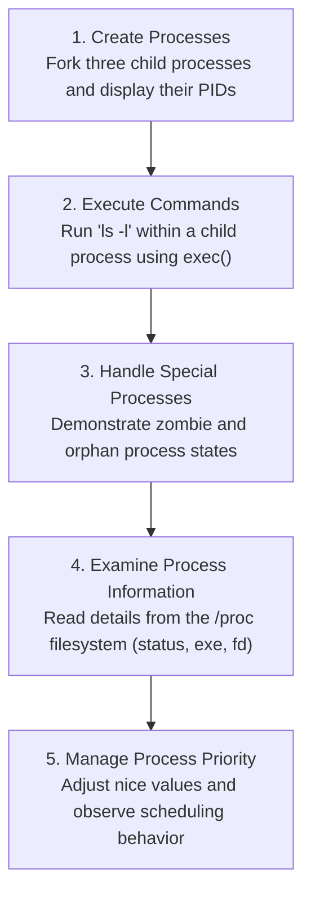

**Operating Systems Lab Assignment**  
**Submitted by: Prateek Kumar Prasad, B.Tech CSE, Semester 5, Roll No: 2301420018**

# Experiment 1: Process Management in OS

## Summary of Tasks

---

### OS Assignment: Process Management in Linux

This repository contains a comprehensive 5-task assignment on **process management** in Linux, completed by **Prateek Prasad** for a 5th-semester Operating Systems course. The tasks demonstrate key concepts using C system calls and interactions with the Linux kernel's process information a.k.a **`/proc`** filesystem.

---

### **Task 1: Creating and Managing Processes**

This section focuses on the fundamental concepts of process creation. The goal is to:

- Create **three child processes** from a single parent process.
- Use the **`fork()`** system call to duplicate the parent process.
- Display the **Process IDs (PIDs)** of all child processes to verify their creation.

### **Task 2: Executing External Commands**

This task explores how a process can execute a completely different program.

- A child process is created specifically to run an external command.
- The **`exec()`** family of system calls is used to replace the child process's image with the **`ls -l`** command.

### **Task 3: Demonstrating Special Process States**

This section dives into the lifecycle of processes, specifically focusing on states that can occur if not handled properly.

- **Zombie Process**: A terminated process whose parent has not yet collected its exit status.
- **Orphan Process**: A process whose parent has terminated, causing it to be adopted by the **`init`** (or **`systemd`**) process.

### **Task 4: Examining Process Information**

This task demonstrates how to programmatically access detailed information about a running process directly from the Linux kernel.

- Read details from the virtual **`/proc`** filesystem.
- Extract information such as the process **status**, the path to its **executable file**, and its open **file descriptors**.

### **Task 5: Managing Process Priority**

This final task illustrates how process scheduling can be influenced by adjusting a process's priority.

- The **`nice`** value is used to adjust a process's scheduling priority.
- A **lower nice value** (e.g., -20) gives the process a higher priority and more CPU time.
- A **higher nice value** (e.g., +19) gives it a lower priority.

---

## Process Flow (Visual)

## Included Files

- `process_management.py`: The main Python script containing the implementation for all tasks.
- `output.txt`: A file containing sample output from the script execution.
- `OS_Lab_Assignment 1.docx`: The original assignment document.
- `report.pdf`: The detailed lab report for this experiment.
