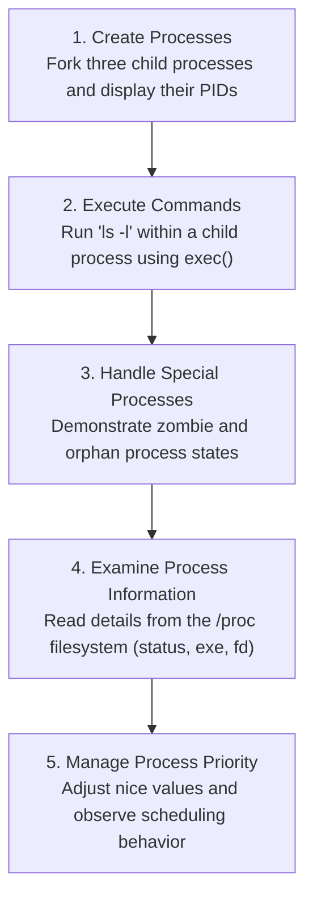

**Operating Systems Lab Assignment**
**Submitted by: Prateek Kumar Prasad, B.Tech CSE, Semester 5, Roll No: 2301420018**

# Experiment 1: Process Management in OS

## Summary of Tasks



## Detailed Task Descriptions

- **Task 1: Process Creation**: A utility to fork three child processes and print their respective Process IDs (PIDs) and Parent Process IDs (PPIDs).
- **Task 2: Command Execution with `exec()`**: Demonstrates executing the `ls -l` command from within a child process.
- **Task 3: Zombie and Orphan Processes**: A simulation to create and show defunct (zombie) and orphan child processes.
- **Task 4: Inspecting `/proc` Filesystem**: A script to parse and display process status, executable path, and open file descriptors from the `/proc` directory.
- **Task 5: Process Prioritization**: An example of how to set different `nice` values for processes to influence CPU scheduling.

## Execution Instructions

To run the script, use the following command in your terminal:
```bash
python process_management.py
```

## Included Files

- `process_management.py`: The main Python script containing the implementation for all tasks.
- `output.txt`: A file containing sample output from the script execution.
- `OS_Lab_Assignment 1.docx`: The original assignment document.
- `report.pdf`: The detailed lab report for this experiment.
- `Screenshots/`: A directory containing various screenshots of the output.